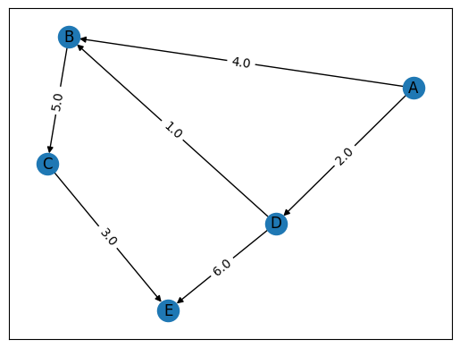
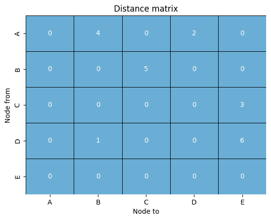

# Dijkstra's algorithm visualiser

This is just a fun tool to visualise how Dijkstra`s algorithm works.

## The algorithm

Dijkstra's algorithm allows us to find the shortest distance between any two nodes on a graph. But how does it work?

### What is a directed graph?

A `directed graph` is simply a graph with `edges` connecting `nodes` that can be one way, meaning that you can traverse along them towards a node but not back. This can lead to some interesting problems, an example of a directed graph is below:

  
  
A directed graph with 5 nodes.

We can see here that we can traverse from node `A` to node `B` but not from node `B` to node `A`!

### Direction matrices

We can denote a graph mathematically using a `direction matrix`:

  
  
The above graph's corresponding distance matrix

The way to interperet this is seeing the y axis as being the `node from` and the x axis as being the `node to`, so for example if we want to know the distance going from node `A` to node `B`, we look for `A` vertically and `B` horizontally, these align on `4` showing that the distance between them is 4, for a sanity check we can compare to the diagram, and it's correct!

### Dijkstra's algorithm

Now we can tackle the beast that is `Dijkstra's algorithm`. Here are the steps:

1. Choose a starting node, create a list of distances of nodes from that starting node, each element apart from the element that represents this node should be set to ∞, so it should look like [∞,∞,∞,...,0,...,∞], also create a list of unvisited nodes to keep track which nodes you have visited.
2. Find all nodes that are `neighbours` of your node, meaning that they connect via an `edge`, for each edge found calculate the new distance to that node, if this distance is less than the distance stored in the distance list, replace that larger distance with this smaller one.
3. Move to the nearest neighbour to the previous node and repeat step 2. Terminate the algorithm if all nodes have been visited, i.e when your list of unvisited nodes is empty.

### Time complexity

You may be asking why it would be worth it to use `Dijkstra's algorithm`, we use it due to its `logarithmic` time complexity, meaning that it performs very well for large graphs, the order of the algorithm is actually:

$$O(E\log(V))$$

Where $E$ is the total number of edges and $V$ is the total number of nodes.

This means that for each edge added the time to run the algorithm increases multiplicatively and for each node added the time increases logarithmically.

Note that the proper way to make this algorithm efficient is to use C++ or some other `lower level` language than python!